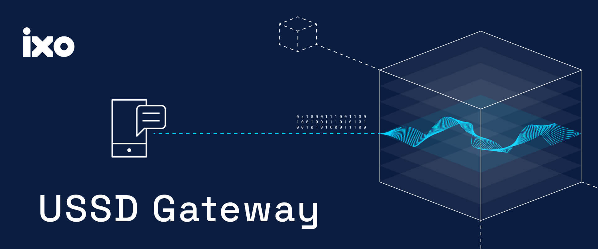

# 📱 IXO USSD

`ixo-ussd` is an open-source project that brings **verifiable Web3 impact tools** to any mobile phone — even without internet access 📱⚡.

[](.github/workflows/test-coverage.yml)  
[](https://img.shields.io/github/v/release/ixoworld/ixo-ussd)  
[](./LICENSE) [](https://github.com/ixoworld/ixo-ussd/graphs/contributors) [](https://docs.ixo.world)



---

## 🌍 Overview

Run it vanilla. Fork it. Build your own USSD-powered impact solutions.

Built as part of the **IXO World** ecosystem, it enables communities anywhere to interact with the global impact economy through simple, reliable USSD menus. Whether you’re connecting rural stewards, enabling on-chain verifications, or piloting local reward systems, `ixo-ussd` gives you the infrastructure to make it happen — **securely, inclusively, and at scale**.

The IXO USSD gateway makes it possible for anyone to access blockchain-powered tools on any GSM mobile phone — no smartphone or data plan required.

It’s built to be adaptable: fork this repo, start with the vanilla setup, and quickly customise it to your community, use cases, or technology stack.

---

## ✨ Features

- ✅ **Offline-ready** — works on any GSM mobile phone via USSD
- ⚡ **Fast & lightweight** — optimised for low-latency menu navigation
- 🔐 **Secure** — robust PIN handling, session management, and private data vaults
- 🔗 **Integrates** with IXO blockchain and Web3 identity tools

---

## 📦 Quick Start

Fork this project and adapt it for your own USSD use cases.

### 1. Fork and Setup

```bash
# Fork on GitHub, then clone
git clone https://github.com/YOUR_USERNAME/ixo-ussd.git
cd ixo-ussd
pnpm install

# Configure environment
cp env.example .env
# Edit .env with your PostgreSQL details
```

### 2. Database and Start

```bash
# Run migrations and start server
pnpm build && node dist/src/migrations/run-migrations.js
pnpm dev
```

### 3. Test

```bash
# Test USSD flows interactively
pnpm test:interactive
```

**Need detailed setup help?** → [Getting Started Guide](./docs/GETTING_STARTED.md)

**Ready to customize?** → [Architecture Guide](./docs/ARCHITECTURE_PATTERNS_GUIDE.md)

**Need Web3 integration help?** → [Web3 Integration Guide](./docs/WEB3_INTEGRATION.md)

---

## 📚 Documentation

- **[Getting Started Guide](./docs/GETTING_STARTED.md)** - Setup, environment config, and first steps
- **[API Reference](./docs/API.md)** - USSD endpoints, request/response formats, and integration examples
- **[Architecture Patterns](./docs/ARCHITECTURE_PATTERNS_GUIDE.md)** - State machine design patterns and best practices
- **[State Machine Development](./docs/STATE_MACHINE_PATTERNS.md)** - Development workflow and testing patterns
- **[Demo Files Guide](./docs/DEMO_FILES_GUIDE.md)** - Interactive development and testing tools

---

## 🧙‍♂️ Contributing

We ❤️ contributions!
See our [Contributing Guide](./docs/CONTRIBUTING.md) and our [Code of Conduct](./docs/CODE_OF_CONDUCT.md).

**Quick steps:**

1. Fork & clone this repo
2. Install dependencies: `npm install`
3. Run tests: `npm test`
4. Open a pull request 🎉

---

## 🧪 Tests

```bash
pnpm test
```

We use GitHub Actions for CI — all pull requests run the test suite automatically.

---

## 📦 Release Process

We use [Semantic Versioning](https://semver.org/) and release via GitHub Actions.
See [CHANGELOG.md](./docs/CHANGELOG.md) for history.

---

## 🗺 Roadmap

See our [open issues](https://github.com/ixoworld/ixo-ussd/issues) for planned features and known issues.
Vote on what’s next by adding 👍 reactions.

---

## 💬 Community & Support

- [GitHub Discussions](https://github.com/ixoworld/ixo-ussd/discussions)

---

## 📄 License

[Apache 2.0](./LICENSE) © 2025 IXO World

---

## 🙌 Acknowledgements

Thanks to all [contributors](https://github.com/ixoworld/ixo-ussd/graphs/contributors) and the open-source community 💚
A special thank you to the Grassroots Economics team for setting us down this path with their now-archived repo named [`cic-ussd`](https://github.com/grassrootseconomics/cic-ussd) 🌱
